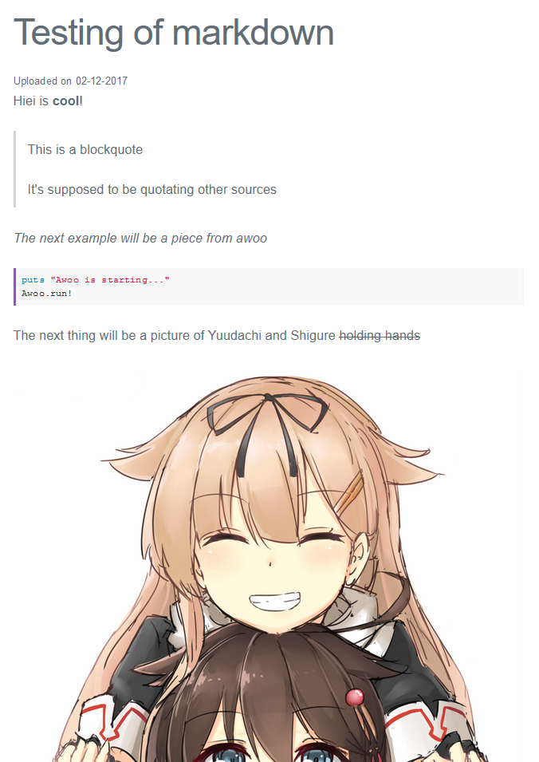

# hiei (比叡)

Hiei is a barebones blog CMS made in PHP using [Parsedown](https://github.com/erusev/parsedown), [milligram.css](https://github.com/milligram/milligram) and [highlight.js](https://highlightjs.org/).

There is no login screen, no WYSIWYG editor. Hiei is made to be barebones and easily modifiable.

Articles are written in `markdown` and should be uploaded to the folder you've specified in `config.php`.
